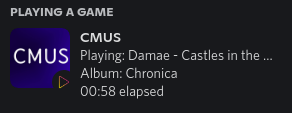
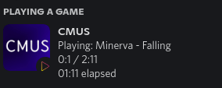
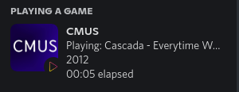

# A Discord Rich Presence for cmus player

[](https://sonarcloud.io/summary/new_code?id=Anas-Elgarhy_cmus-rpc)
[](https://sonarcloud.io/summary/new_code?id=Anas-Elgarhy_cmus-rpc)
[](https://sonarcloud.io/summary/new_code?id=Anas-Elgarhy_cmus-rpc)
[](https://sonarcloud.io/summary/new_code?id=Anas-Elgarhy_cmus-rpc)
[](https://sonarcloud.io/summary/new_code?id=Anas-Elgarhy_cmus-rpc)
[](https://sonarcloud.io/summary/new_code?id=Anas-Elgarhy_cmus-rpc)
[](https://sonarcloud.io/summary/new_code?id=Anas-Elgarhy_cmus-rpc)
[](https://sonarcloud.io/summary/new_code?id=Anas-Elgarhy_cmus-rpc)
[](https://sonarcloud.io/summary/new_code?id=Anas-Elgarhy_cmus-rpc)
[](https://sonarcloud.io/summary/new_code?id=Anas-Elgarhy_cmus-rpc)
[](https://app.codacy.com/gh/Anas-Elgarhy/cmus-rpc?utm_source=github.com&utm_medium=referral&utm_content=Anas-Elgarhy/cmus-rpc&utm_campaign=Badge_Grade_Settings)
[](https://www.codefactor.io/repository/github/anas-elgarhy/cmus-rpc)






- Require jdk-17 or higher
- Require cmus
## Install

### Linux
- From aur: `yay -S cmus-rpc`
- Manual:
- Make sure you installed `wget`
- Run this command
   ```bash
    curl -s https://raw.githubusercontent.com/Anas-Elgarhy/cmus-rpc/master/scripts/install.sh | sudo bash
   ```

## Uninstall

### Linux
- Manual:
- Run this command
  ```bash
    curl -s https://raw.githubusercontent.com/Anas-Elgarhy/cmus-rpc/master/scripts/uninstall.sh | sudo bash
  ```


- Requirements for development:
    - jdk-17 or higher
    - Maven
    - IntelliJ IDEA (not required but recommended)

### Options:
| Option                      | Description                                                  | Values                    |
|-----------------------------|--------------------------------------------------------------|---------------------------|
| `-h` or `--help`            | Show the help                                                | -                         |
| `-v` or `--version`         | Show the version                                             | -                         |
| `-d` or `--debug`           | Debug mode                                                   | -                         |
| `-l` or `--link`            | Linking with cmus (close the program if cmus is not running) | -                         |
| `-c` or `--config`          | Set custom path to config file                               | Path to config file .json |
| `-i` or `--interval`        | Set interval between checks                                  | interval time (seconds)   |
| `-s` or `--sleep`           | Set sleep when there is no activity                          | sleep time (seconds)      |
| `-p1f` or `--partOneFormat` | Set the format for the first part                            | Format for first part     |
| `-p2f` or `--partTowFormat` | Set the format for the second part                           | Format for second part    |


### Examples:
```bash
cmus-rpc -p1f %title%
```

```bash
cmus-rpc -p1f "%artist% - %title%" -p2f "%album% - %date%"
```

```bash
cmus-rpc -p1f "Anas listening to %title%" -p2f "From %artist%"
```

### How to do auto run when you start the cmus
- Put the following line in your shellrc file e.g. `.bashrc` or `.zshrc`
```bash
    alias cmus = 'cmus-rpc --link &>/dev/null & cmus'
```

### Available in
[](https://github.com/Anas-Elgarhy/cmus-rpc)
[](https://gitlab.com/Anas-Elgarhy/cmus-rpc)
[](https://bitbucket.org/anas_elgarhy/cmus-rpc)
[](https://codeberg.org/anas-elgarhy/cmus-rpc)


### Recourses
- [`cmus-remote` tool](https://github.com/cmus/cmus) to the make a query to the cmus
- [Discord-RPC library](https://github.com/Vatuu/discord-rpc) to send the information to Discord
- [The Discord API](https://discordapp.com/developers/docs/intro) to learn more about RPC
- [commons-clib2 library](https://github.com/apache/commons-cli) to parse the command line arguments
- [jackson library](https:github.com/FasterXML/jackson-databind) to save the config.json and load it
- [cmus-rich-presence](https://github.com/pascalpuffke/cmus-rich-presence) for inspiration

[](https://sonarcloud.io/summary/new_code?id=Anas-Elgarhy_cmus-rpc)

[](https://sonarcloud.io/summary/new_code?id=Anas-Elgarhy_cmus-rpc)

[](https://spdx.org/licenses/MIT.html)